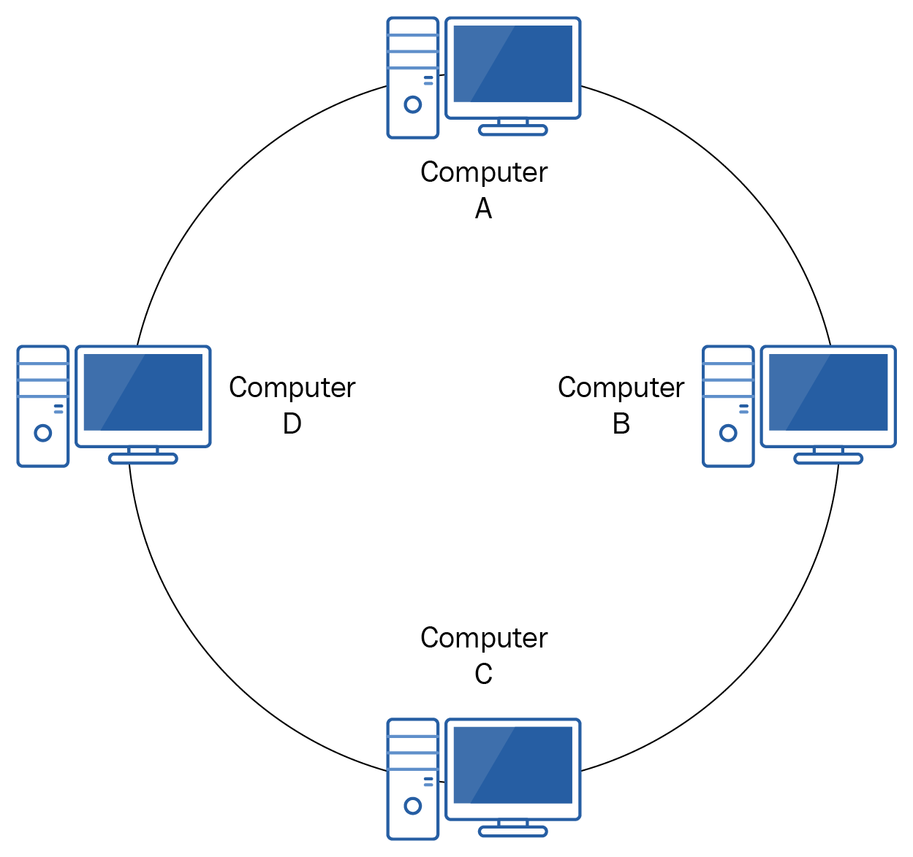
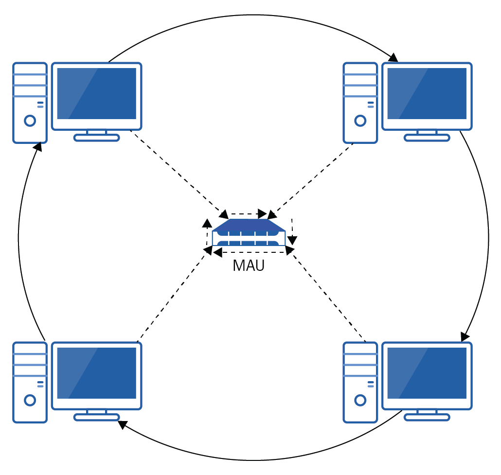
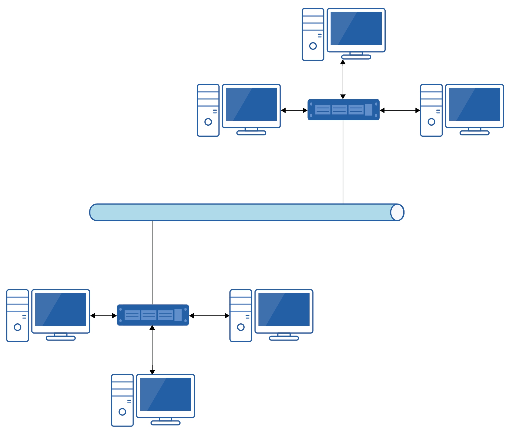
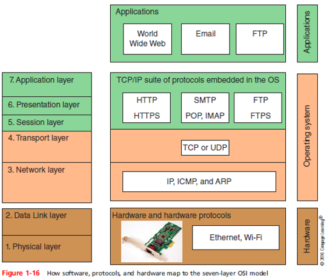
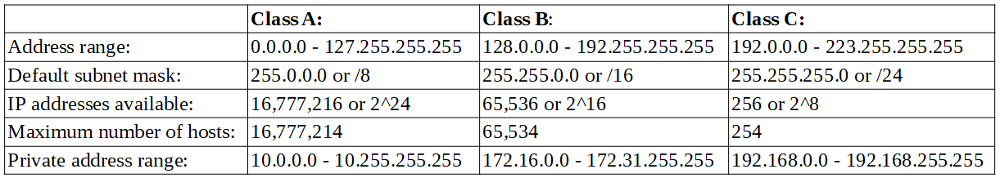

# I. Network Infrastructure
## What's a network?
**Def:** A set of 2 or more endpoint devices that communicate with each other through a shared medium.

Example of endpoint devices: computers, laptops, servers, phones, cell phones, games consoles, smart TVs, fridges, heating systems, speakers, etc.

All of these devices contain at least one **network interface card (NIC)** and are running a **network operating system (NOS)** and have been coded in a way that takes advantage of one or more of the networking protocols.

**Protocols**: set of rules or standards that have to be adhered to

### Scales of networks
Determined by how much area they cover or what type of area they cover: WAN > MAN > CAN > LAN > PAN
- Wide Area Networks (WANs)
- Metropolitian Area Networks (MANs): Network that spans across a city. Example customer: Trains' wifi, property management org, etc.
- Campus Area Networks (CANs): Network that connects multiple LANs within a defined geographical are such as university site, company campus.
- Local Area Networks (LANs): Covers a *small geographical area* that's small enough that the devices are seen as local to each other. Usually all of those devices are owned by a family or an org. [How device communicate in LANs](#communication-from-local-device-to-local-device)
- Personal Area Networks (PANs): network of devices around a person. eg: phones and smart watches transmit data through Bluetooth instead of a LAN
  
###  Considerations when implementing a network
- Budget: on equipment, third-party support, time frames, etc
- Skill set: to implement and maintain the network
- Existing infra: integrate with the existing infra or replace it?
- Hardware: What equipment do you want to use for end users, network devices, etc? Are they compatible with each other?
- Environment: Do you have sufficient power to support all network devices? What coverage do you need to provide?
- Number of users: Can you support all users and still provide a quality service? Do you need to balance the network load across a number of devices to provide that quality?
- Security: How are you going to protect your data in transit? How are you going to protect your network devices from physical attacks?
- [Network model](#network-models): Peer-to-peer network or client-server network

## Intranets? Extranets? DMZ?
### Intranet
> *intra-* means on the inside

**Def:** Intranet relates to network communication within our network &rightarrow; services provided within an intranet are restricted to the network.

Example: company intranet that hosted internal web pages such as HR self-service portal

### Extranet
> Is a part of the intranet

**Def:** Permit trusted or authorized external organizations such as business partners or larger customers to access certain resources in an intranet.

### DMZ
**Def:** A perimeter network allowing the public to access to certain network services while still maintaining the security of your internal devices.

Common services in the DMZ: web server, **Domain Name System (DNS)** server

DMZ vs. extranet: DMZ allows the public, extranet only allows trusted or authorized org

## Firewalls
**Def:** Designed to either allow or deny network traffic based upon a set of defined criteria that are predefined and/or user-created. These rules could be applied to outbound (aka egress) traffic or inbound (aka ingress) traffic.

Rules application order: Firewall applies the first one that matches and stop further processing.

**Access control entries (ACEs)**: the rules

**Access control list (ACL)**: a group of ACEs

Two types of firewall
- Host-based: Built into the OS or installed on the device
  - Pros: Protect a device from external attack
  - Cons: Need to configure the firewall on each device + only protects that device. Not all devices can have host-based firewall (eg: IoT devices).
- Network-based: Through a hardware device or another network device like a router
  - Pros: Protect all of the networks and monitors traffic going in and out of the network
  - Cons: Can't protect individual devices, so if a computer is compromised there's nothing preventing it from attacking others. 

Best practices for org:
- Purchase firewalls from 2 different manufacturers so vulnerability in one wouldn't be replicated across the network
- Any network should run both host-based and network-based firewalls

## VPNs
**Def:** A way of transmitting private data securely from one network across an unsecured network to a third network. VPN tunnels provide data security through the use of encryption and authentication.

VPN implementation
- VPN concentrator: the concentrator at each source will directly connect to the VPN concentrator at the destination
- Install a VPN client on the device: users need to authenticate via the VPN client before gaining access.

Regardless of VPN implementation, the user's device will appear as if it's on the destination's network.

## Local addresses
### Hostname
**Def:** A computer's hostname is an human readable method of identifying a device on the network. Device's hostname is configured by the sys admin.

2 ways to find your device's hostname
- In Command Prompt, type `hostname`
- In Windows box, search for "View your PC name". Hostname = Device name

Trade-offs
- Pros: Human-readable
- Cons: Might not be unique. Not device friendly since their syntax doesn't convey whether the device is on a local or remote network.

### IP address
Has 2 sections
- Network section: Used to indentify the network a device is on ~ street name
- Host section: Used to identify a device on a network, so it's unique on a network ~ house number

Using IP addr and a subnet mask can identify whether a host is local to the sending device or on a remote network.

For IPv4, there're 3 ranges of IP addresses that can be used in LANs. These addr are called **private IP addresses** and are non-routable outside of your network. 
- Class A: 10.0.0.0 -> 10.255.255.255
- Class B: 172.16.0.0 -> 172.31.255.255
- Class C: 192.168.0.0 -> 192.168.255.255
> **Why private IP addresses?** The number of IPv4 addr available globally are limited, so we want to reuse some of them. Addr in these ranges can be used in multiple LANs as long as it's unique within each LAN.
> Ofc, you can use IP addr out of these ranges for devices on your LANs but it would cause numerous issues since other devices would have a hard time figuring out that the device is on the same network when it appeared to be not based on the network section of the IP addr.

### MAC address
A way to identify a device on a LAN. Also known as physical address, hardware address, or a **burnt-in address (BIA)** since it's on/burnt into the physical network card. Is a 48-bit hexadecimal number.

MAC addr are used for local communication while IP addr are used for local and remote communication.

Representation: 12 characters broken into 6 pairs separated by a '-' (- separation is Windows specific). (eg: 08-00-27-F5-50-3F)

To find MAC address: In Command Prompt, type `ipconfig /all`. MAC address = Physical address.

Properties
- Is globally unique. No network cards have the same MAC address.
- The first 6 characters is an **Organizationally Unique Identifier (OUI)** that identifies the network card manufacturer &rightarrow; can be looked up using an online OUI lookup site
- The last 6 characters uniquely identify a network card from a manufacturer
- Given an IP address, **Address Resolution Protocol (ARP)** is used to find the corresponding MAC address

## Address Resolution Protocol (ARP)
Why? Given an IP address, APR is used to find the corresponding MAC address

How it works
- A computer shouts out to all the devices on the network (broadcasts) asking who has the IP address you're communicating with
- All devices on the network will receive the ARP request and will look at the IP addr that was requested
  - If the IP addr doesn't belong to that device, it'll ignore the request
  - If the IP addr does belong to that device, it'll send an ARP reply saying that IP address ABC belongs to MAC addr XYZ
- Once the MAC addr is known for its IP addr, the Windows device will store the addr resolution in its ARP cache, which is checked before an ARP request is sent. An entry is this cache is store between 15-45 seconds based on settings. To see ARP cache, in Command Prompt `arp -a`

> MAC addr ff:ff:ff:ff:ff:ff, also called a **broadcast** MAC addr, is used when a device want to speak to all the devices on the network.

## Communication from local device to local device
Simplified process
- Get the recipient hostname
- Resolve the recipient hostname to an IP addr
- The sender checks to see if the IP addr is on the local network
- The sender checks the ARP cache for an IP-to-MAC mapping. None are found.
- The sender broadcasts an ARP request
- The recipient machine sends an ARP reply
- The sender updates its ARP cache
- The sender packages the data to be transferred and sends it out
- The recipient machine receives the data and checks that the destination MAC addr belongs to it. It does
- The recipient machine checks that the destination IP addr belongs to it. It does.
- The recipient machine processes the data that's dependent on the service/application it's for

## Communication from local device to remote device
- Get the recipient hostname
- Resolve the recipient hostname to an IP addr
- The sender checks to see if the IP addr is on the local network. Since it's remote, any data that's transmitted needs to be sent via the default gateway (GW)
- The sender looks up the IP addr of the default GW
- The sender checks the ARP cache for an IP-to-MAC mapping for the default GW. None are found
- The sender broadcasts an ARP request, aking for the MAC addr of the IP addr linked to the default GW
- The default GW sends an ARP reply
- The sender updates its ARP cache
- The sender packages the data to be transferred. It stipulates that the destination MAC is that of the default GW but the destination IP addr is that of the remote device
- The sender transmits the data to the default GW
- The default GW receives the data and checks that the destination MAC addr belongs to it. It does.
- The default GW checks that the destination IP addr belongs to it. It does not.
- The default GW forwards the data, as per its *rules* to the destination device. The source and destination MAC addr are altered at each router they transit, but the IP addr remain the same.
- The recipient machine receives the data and checks that the destination MAC addr belongs to it. It does.
- The recipient machine checks that the destination IP addr belongs to it. It does.
- The recipient machien processes the data that's dependent on the service/app it's for.

## Network models
### Peer-to-peer (P2P) aka workgroup
Properties
- No device has complete control of the network, files, services, etc. on the network
- All network endpoints have the same status and responsible for authenticating users, controlling access to the files, services, etx.

Trade-offs
- Pros: Doesn't require a server, so no support staff needed to have a higher-level skill set &rightarrow; good for small env of less than 10 users/devices
- Cons: Administrative overhead of setting up each machine

### Client-server
Properties
- Centralized adminstration
- Utilizes a domain model such as AD for authentication and control when accessing resources 

## Wired and Wireless networks
> - Minimum number of endpoints to create a network is 2
> - When there are more than 2 endpoints, **interconnectivity devices** are needed to link the endpoints together.
> - Example of interconnectivity devices: hubs, bridges, switches, routers
### Wired
Using a switch:
- What it does: Create a virtual connection between devices
- How it works: A switch learns which of its port a particular MAC address is connected to and use this knowledge to make message forwarding decision.
- Allow great network segmentation. As your org grows, you can create tiered switches with access layer, distribution layer, core layer, etc to handler greater capacity while maintaining speed
- Offer full-duplex communication i.e. data can flow in both directions at the same time. (*Half-duplex allows data to flow in both directions but it can only flow in 1 direction at a time*)
- Allow all devices to communicate at the same time. If device A wants to talk to device C while device B is talking to device C, the switch buffers the data until there is a *gap* in the traffic, then it forwards it on.

#### CSMA/CD - Carrier sense multiple access/Collision detection
- Is an netowork access method (eg: how a device know when to transmit) used for a lot of wired connections
- Carrier sense = Device wishing to transmit on the network has to listen out for a gap in the traffic 
  - Transmit if no device is talking
  - Else, wait a random amount of *back off* time before repeating
  - If 2 devices start talking at the same time, they send a jamming signal that tells all other devices not to transmit + both *back off* for a random period of time before repeating

### Wireless
Has 2 types
- Ad hoc: Devices connect directly to each other without going through any interconnectivity device
- Infrastructure: Devices connect to each other going through an interconnectivity device

Requirements
- Wireless NIC in the endpoint devices

**Wireless Access Points (WAPs)** allow wireless devices to connect to the wired LAN &rightarrow; once connected to a WAP devices can communicate regardless of whether they are wired or wireless. WAP has **service set identifier (SSID)** which is the human-readable name of the wireless network. 

In a home network, it's common to have a device that functions as a WAP, a switch, and a router: **wireless routers**.
- Allow endpoints to connect directly to it
- Have separate circuitry for each function that allows for one circuit to pass data to another when required

#### CMMA/CA - Carrier sense multiple access/Collision Avoidance
- Is a network access method
- Carrier sense = Device wishing to transmit on the network has to listen out for a gap in the traffic --> Transmit if no device is talking. Else, wait a random amount of *back off* time before repeating

## VLAN
### Broadcast domain
**Def:** When a device sends out a broadcast transmission, it's sent to every device on the LAN. All the devices receiving that broadcast transmission are said to be on the same broadcast domain. 

Broadcast domain is limited to your LAN since router aren't designed to forward broadcast transmissions.

Why broadcast? ARP, etc.

Since broadcast is sent to every device on a LAN, we might want a smaller LAN to optimize transmission.

### VLAN 
Each VLAN is its own broadcast domain &rightarrow; allow us to break the network down further by creating virtual switches so broadcast transmission would be more efficient and thereby increase network performance.

Usually identified by a number (eg: VLAN 10, VLAN 20, etc.)

Ways to break down the LAN into VLANs:
- One for each floor of a building
- One for each department
- One for each classroom in a school
- One for different levels of security
- One for data and one for voice communications

## Broadband: Circuit switching and Packet switching
> One way to connect a network to a WAN. Other ways include leased lines (*dedicated* connection between 2 locations) and dial-up.
### Circuit switching
This is used in the olden day before packet switching.

How it works: There's a *physical* connection between 2 devices. For example, the connection between 2 telephones will go through multiple telephone exchanges where operetors at these exchanges would manually plug and unplug cables to make or end physical connection.

Drawbacks: If there was a break in the connection, there was no redundancy in place, and a new connection had to be initiated i.e. if a connection failed during a data transfer, you would need to re-transmit.

### Packet switching
How it works: Data is broken down into smaller chunks called **packets**, and a *virtual* connection is made between the devices. While circuit switching has a fixed path, there's no fixed path in packet switching and each packet can take a different route.

Packet format = Portion of the original data (payload) + a header + a trailer

Header and trailer are called management overhead.
- Header: info such as the source and destination addr, segmentation #, other details
  - Segmentation #: Used to rebuild the segmented data at the recipient's end + a way to account all the data
- Trailer: 
  - **Cyclic redundancy check (CRC)**: for error checking

Packet sending process:
- The sending device performs a mathematical calculation on the data being sent
- The output of that calculation is added to the trailer
- On receipt of any data, the receiving devic performs the same calculation
- The receiving device than compares its result with the value stored in the trailer i.e. CRC
- If the 2 values match, data has been transmitted correctly
- If they do not match, data is deemed to be corrupted and correction/re-transmission is required

Packet sizes depend on the network. eg: If a network supports packet size of 512 bits and each packet has 124 bits of overhead (92 bits for the header and 32 bits for the trailer) &rightarrow; Payload size = 512 bits - 124 bits = 388 bits &rightarrow; # of packets = original file size / Payload size

To identify the path the data takes, use `tracert` (trace route) command
```bash
tracert 8.8.8.8

# Sample output
# Tracing route to dns.google [8.8.8.8]
# over a maximum of 30 hops:
# 
#   1     3 ms     3 ms     2 ms  64.124.55.5
#   2    14 ms     3 ms     4 ms  ae28.cs1.sea1.us.eth.zayo.com [64.125.29.102]
#   3     *        *        *     Request timed out.
#   4     3 ms     2 ms     2 ms  142.250.169.166
#   5     3 ms     4 ms     3 ms  142.251.70.103
#   6     5 ms     3 ms     3 ms  209.85.254.249
#   7     2 ms     2 ms     5 ms  dns.google [8.8.8.8]
# 
# Trace complete.
```
- IP addr of `8.8.8.8` is resolved to its **fully qualified domain name (FQDN)** of `dns.google`
- 30 hops = 30 routers
- Hop 1 is the default gateway
- `tracert` ping each hop 3 times and records the latency i.e. how longs it takes for a reply to come back from the router
- Hop 3 router showed astericks, which indicate that the device chose not to provide a reply, but still forwarded the request

Packing switching implementation: X.25, frame relay

## Wireless Networking
TODO

## Network Topologies
**Def**: Topology is a map that details how the network fits together and how the data travels. Topology is either *physical* or *logical*. Often, these two are the same
  - Physical topology: Describes how the devices are connected together
  - Logical topology: Describes how the data travels from device to device

### Bus topology
- Look like a backbone cable with devices connected directly to it
- <Insert diagram here>
- *Note*: When the signal reaches the end of the cable, it will *bounce* back along the cable --> There is a device called a terminator which kills the signal and prevents this bounce
- Pros
  - Simple -> good for a small network
  - Cheap since uses a minmal amount of cabling
  - Easy to extend
  - Offer some resilience in failure of one node/one connection since it only impacts communications to and from the failing device
- Cons
  - Uses half-duplex transmission and forms 1 big collision domain -> If one computer is transmitting, no others can transmit so the whole method is not very efficient
  - In regard to CSMA/CD, potentially have collisions happen especially when more devices are added to the network (2 devices talking at the same time) -> delay communication
  - Backbone cable creates a single point of failure -> can bring the whole network down
  - Difficult to troubleshoot

### Ring topology
- Look like a ring i.e. each device is connected to two devices and data is transferred by passing it on to the next device in the network until the destination device is reached
- The config can allow traffic to go unidirectional or bidirectional



- Pros:
  - Simple to troubleshoot since if computer A can talk to computer B but not computer C -> there's a problem between computer B and C or the devices themselves
  - No collisions since there's no fighting for network access
  - Reduce signal attrition since each device receiving data will regenerate the signal before passing it on to the next device
  - Easy to add a new device onto the network 
- Cons:
  - Adding a new device = brought down the entire unidirectional network (fine if bidirectional network)
  - Potential traffic delay if there're many devices on the network since each device needs to perform a check on the data it receives before passing it on

### Star topology
- Look like a star since all devices connect to a central point, which could be a hub/switch/router/server
- Pros
  - Efficient and fairly resilient i.e. failure in one does not bring the whole network down -> most common topology
  - Easy to add a new device since it wouldn't bring the whole network down
  - Scale well to large networks
- Cons
  - The central device is a single point of failure
  - Can be expensive since all devices need long enough cable to connect to the central device wherever it is

### Token ring (Physical star topology + Logical ring topology)
- **Def**: A device can only talk when it has a *token*. The token is passed from device to device with device relinquish it once it finishes talking
- Physical star topology since all devices connect to a central device called **Media access unit (MAU)**
  - MAU: Is used to overcome the drawback of a ring topology. When a device is down, MAU will detect it and the token will skip that device -> service is continue
- Logical ring topology since the data goes from device to device and ignores the MAU



### Mesh topology
- Two type of mesh
  - Full mesh network: Every device is connected to every other device
  - Partial mesh: Some devices that are connected to all of the other devices.
- Devices with this topology are usually switches or routers since they offer multiple available interfaces since for a mesh to work every device need to have a separate interface for each of the other devices
- Pros
  - Fault tolerance since there's a high level of redundancy -> there's always an alternate path if a connection goes down
- Cons
  - Expensive due to the # of cables and interfaces required
  - Skill reuired to configure the mesh for redundancy since it's not simple to configure routing for failover

### Hybrid topology
- **Def**: Mixed components that connects two or more different network topologies 



- Pros: Leverage the benefits of the component topologies while minimizing the disadvantages

---
# II. Network Hardware
## Switches
- Purpose: Forward traffic form one device to the next within a LAN
- Why: To segment a network into smaller, more manageable and more efficient areas
  - Reduce collision since each segmentation is its own collision domain and segmentation reduce the size of each domain
### Methods of frame forwarding
#### Cut-through switching
- How-it-works: A switch forwards the data immediately once it knows source + dest MAC addresses even when it has not received the whole frame
- Pros: Fast
- Cons: Even frames containing errors are forwarded since the switch forwards data even before seeing the content

#### Store-and-forward
- How-it-works: The switch will store the frame data in its memory buffer until the complete frame has been received -> Error checking is performed -> Forward the frame
- Pros
  - Corrupt frames are discarded
  - Allow data to be prioritized through **Quality of Service (QoS)**

### Process for frame forwarding
When a switch receives data from a device
- It checks to see if the source MAC address is in its MAC table aka **Content Addressable Memory (CAM)** table 
  - If not, the table is updated with info on which interface the sender's MAC address is on
- Then, it looks to see if there's an entry for the destination MAC address
  - If yes, the frame is forwarded internally to the interface that's listed, which is transmitted to the dest device
  - If no, the switch will broadcast the frame from all its interfaces. All devices receiving the frame will check the dest MAC address to see if its theirs -> ignore if it's not intended
- Hopefully, the intended recipient will receive the frame and respond
- The process is repeat

### Spanning Tree Protocol
- Purpose: Prevent looping between switches when redundant links are implemented
- How: An election takes place between the switches to decide which switch will be classed as the *root bridge* -> The switches identify which of their interfaces are closest to the root. These are called **root ports (RP)**
  - RP will always be available
  - Other ports are either designated ports (DPs) and non-designated ports (NDPs)

### Characteristics of switches
- Can be managed or unmanaged
  - Unmanaged: Comes with preloaded config that can't be changed. Use purely to allow endpoint devices to communicate with each other
  - Managed: Allow VLANs, port speeds, security, etc to be configured
- Layer 2 switch: Only supports forwarding data based on MAC addresses
- Layer 3 switch: Also offer ability to recognize IP address, traffic routing, etc.
- Security
  - Only forward data through specific interfaces >> a hub send data through all interfaces allowing data to be sniffed
  - Concern: When a switch receive too many new MAC addresses, it will send all frames out of every ports

## Routers
### Interface
- Have at least 2 interfaces
- Each interface has an IP address in the same range as the network it belongs to
- Thenterface IP address = The default gateway IP address for that network

### Routing decisions
- Routing table: info about the networks, interfaces, and metrics
  - `Network Destination`: Network address (specific address or broadcast address)
  - `Netmask`: Is subnet mask
  - `Gateway`: The default gateway where data is sent when the dest network is outside of the subnet
  - `Interface`: Lists of IP address of the local interface from which the data is sent
  - `Metric`: Metric value attributed to that route/interface
- Routing algo
  - Once a router receives data from another device, it checks the dest IP address
  - If the address is itself, it will process it internally. Else if the address if for one of the connected netowrk or a remote network, the router looks it up using its routing table
  - It identifies the IP address of the next router (i.e. next hop) and the interface the data needs to be sent from
- Potential looping problem happens when a router receive some data and route it back to the previous router -> Data stuck in a network forever
  - TTL (Time to Live) is used to solve this problem
    - **Def:** # of hops data can go through before it's discarded 
    - Every packet includes one in its IP packet header
    - Every router decrements TTL value in the packet by 1. When TTL get decremented from 1->0 router sends *unreachable* message to the originator and packet is discarded

### Routing devices
- 3 different categories of routers. All with the ability to route data based on IP addresses + functionalities like NAT, QoS, block broadcast transmissions
  - Dedicated routers: Device specifically for routing data between networks
  - Layer 3 switches can route traffic between different VLANs only (can't fully replace routers) 
  - Servers with routing capability: Configured by having > 1 NIC

#### NAT functionality
- What? NAT takes a private IP address and converts it to a public IP address and vice versa
- Why? # of available IPv4 addresses is limited
- Types
  - Static NAT: Each device has a private IP address mapped to a public IP address. This IP address is used only for this device -> can't reuse so it's costly
  - Dynamic NAT: Each org has a pool of IP addresses where these are shared by all devices inside the LAN. IP address allocation is first come, first serve -> device can't communicate to outside of LAN if network ran out of IP addresses

#### QoS functionality
- What? Prioritize network traffic
- How? The data sent includes **Type of Service (ToS)** or **Differentiated Services (DiffServ)** to allow routers to identify the type of traffic
- Typical prioritized data: Media streaming, VoIP, Teleconferencing, Safety system traffic
- Why? Media traffic should be prioritized else users would experience performance and quality issues with buffering occurring
- Has to be configured on the routers

#### Block broadcast traffic functionality
- Broadcast domain: A collection of devices that can receive a broadcast transmission from each other
- Each interface on a router is its own broadcast domain
- Each broadcast domain can have multiple collision domains
- Why: If a router broadcast transmission it might send this out to the internet -> If all routers do this there will be too much moise

---
# III. Protocols & Services
## Network Models
> 2 network models that became the standard for devices from different manufacturer to communicate are **Open Systems Interconnection (OSI)** from the **International Organization for Standards (ISO)** + TCP/IP model 
> Understand how the layers fit together and what talks to what will help you with troubleshooting issues.
### OSI Model
There're 7 layers. Each layer communicates to the adjacent layers. Each layer communicates to its equivalent layer on the receiving device.
- 7. Application ~ Away
- 6. Presentation ~ Pizza 
- 5. Session ~ Sausage
- 4. Transport ~ Throw
- 3. Network ~ Not
- 2. Data-Link ~ Do
- 1. Physical ~ Please

Layer 1 -> 7: Please Do Not Throw Sausage Pizza Away

Layer 7 -> 7: All People Seem To Need Data Processing

The top 3 layers (**Application**, **Presentation**, and **Session**) are referred to as the upper layers. The bottom 4 layers (**Transport**, **Network**, **Data-Link**, **Physical**) are referred to as the lower layers.

Data goes through the OSI model from layer 7 -> 1 goes through **encapsulation** i.e. a header (and sometimes a trailer) is added to data from a prev layer before passing it to the next layer. (Header + Trailer) at the originating layer is called the *protocol data unit*. (Header + Trailer) at the receiving layer is called the *service data unit*.

Header + Data + Trailer = Data Unit. Data unit in the ...
- Transport layer is called **segments** ~ Some
- Network layer is called **packets** ~ People
- Data-Link layer is called **frames** ~ Fear
- Physical layer is called **bits** ~ Birthdays


> Applications do NOT reside on the application layer of the OSI model. It's above the OSI model.



Layer 7: Application layer
- Purpose: Acts as interface between the application and the network model. Apps contain code that use network API to tell how apps can talk to the application layer.
- Apps support these application layer protocols 
  - Simple Message Transfer Protocol (SMTP)
  - Post Office Protocol (POP)
  - Internet Message Access Protocol (IMAP)
  - Hypertext Transfer Protocol (HTTP)
  - Domain Name System (DNS)
  - Secure Shell (SSH)
  - File Transfer Protocol (FTP)

Layer 6: Presentation layer
- Purpose: Take data from the application layer and converts it into a generic format or syntax
- Why: Native formats of different systems/apps may vary. By converting the data into a generic format, any device receiving the data would be able to understand and convert it into the format the receiving app can understand. 

Layer 5: Session layer
- Purpose: Manage sessions between the devices. Responsibilities include establishing the session, synchronizing the communication between the devices, and terminating the session. Also, this is the layer where devices agree on the type of communication that's going to take place like simplex, half-duplex or full-duplex.
- Protocols supported on this layer
  - RPC
  - SQL
  - NetBIOS
  - **Point-to-Point Tunneling Protocol (PPTP)**

Layer 4: Transport layer
- Purpose: Control host-to-host communication + crate a logical connection between the 2 devices. Responsibilities include initiating the connection between the devices, flow control between the devices, same-order delivery, and multiplex communication (a machine can have many conversations with another machine at the same time).
- 2 main protocols
  - [**Transmission Control Protocol (TCP)**](#tcp)
  - [**User Datagram Protocol (UDP)**](#udp)

Layer 3: Network layer
- Purpose: Responsible for the logical addressing of devices through the use of IP addr + route selection for transmitted data (how to go from A to B using routing protocols like ICMP and ARP) + move messages from one node to another until reaches destination
- The entire Network layer message is called a packet -> network layer header = packet header
- Example of layer 3 devices: routers
- Common protocols
  - IP
  - **Internetwork Packet Exchange (IDP)**

Layer 2: Data-link layer
- Purpose: Create a logical connection between nodes on a subnet. If the destination device is within the same subnet, the link will be to that device. Else, the link will be to the default gateway. Responsibilities include placing data onto physical media, error notifications, and flow control.
  - Error notifs are done using a checksum in the trailer that was added to the data
- Example of layer 2 devices: switches
- Split into 2 sublayers
  - **Logical Link Control (LLC)**: An interface witht the network layer + identifies what network layer protocol is used to store in the frame's header.
  - **Media Access Control (MAC)**: Control how the data is put onto certain media + how data access the media

Layer 1: Physical layer
- Purpose: Transmit data in form of bits
- No protocols but there are standards that cabling and network cards follow
  - Voltages
  - Speeds
  - Wiring

## TCP/IP Model aka Internet Protocol (IP) suite
Similarities to the OSI model
- Layered approach where each layer talking to the adjacent layers and the respective layer on the destination device
- Open/Non-poprietary standard
- Data goes through the model goes through encapsulation process where headers and trailers are added 

> OSI model tends to refers to layers using # like layer 1, layer 2, etc. TCP/IP model tends to rely on words like first layer, second layer, etc.

4 layers. **There's no defined mapping across the OSI model and the TCP/IP model**
- Application layer
- Transport layer
- Internet layer
- Network layer

Fourth layer: Application layer
- Purpose: Acts an interface between the apps and the network stack similar to the application layer in the OSI model. Responsibilities is the OSI's application layer + presentation layer
- Protocols
  - User protocols: Used by the apps the user interacts with
    - Telnet **DO NOT USE + disable it in routers and switches**
      - What? To remote control a device from the CLI (like Command prompt)
      - Port? `23`
      - Sends data in clear text -> attacker can eavesdrop
    - **File Transfer Protocol (FTP)**
      - What? To transfer files from one device to another over TCP
      - Port? `20` and `21`
    - Trivial file protocol (TFTP)
      - What? To transfer files from one device to another over UDP
      - Port? `69`
      - When to use? File transfer on low-bandwidth connections
    - **Simple mail transfer protocol (SMTP)**
      - What? Send emails from an email client to an email server + Transfer email from one email server to another email server
      - Port? `25`
  - Support protocols: Used by the system itself
    - Host initialization
      - What? To boot a computer over a network when it doesn't have its own OS
    - Remote management
      - What? To manage devices through protocol such as **Simple Network Management Protocol (SNMP)**
    - Domain name system (DNS)
      - What? A support service + to resolve fully qualified domain (FQDNs) to IP addr

Third layer: Transport layer
- Purpose: Same as the transport layer in OSI. Responsible for controlling communication between 2 hosts
- Features
  - The use of checksums to ensure data integrity aka error checking
  - The use of sequence # to ensure data is rebuilt in the correct order
  - Flow control to ensure the data that's being received doesn't end up flooding the recipient device
  - Multiplexing to allow a host to have multiple connections to another host
- Protocols: TCP, UDP

Second layer: Internet layer
- Purpose: Same as the network layer in OSI. Responsible for provide logical addressing through the use of IP addr.
- Protocols
  - IP: provides logical addressing + fragment/defragment data transmitted
    - Device might only be able to receive data to a max size of **Maximum Transmission Unit (MTU)** -> Fragmentation breaks the data down into parts to meet the MTU, defragmentation is were data is combined into an MTU (eg: PC A wants to send 5bytes of data, but the first router has an MTU of 1byte so the data has to be broken down into 5 parts. However, the second router has an MTU of 3 bytes so it's inefficint to keep the data in 5 parts so before the data is sent it's combined to form 2 parts)
  - **Internet Control Messaging Protocol (ICMP)**: send error and control messages send by devices to each other. Example messages: host unreachable, host is reachable but the port on the host is unreachable, etc. ICMP powers `ping` and `tracert` commands.
  - **Internet Group Management Protocol (IGMP)**: create logical groups of devices to use during multicast transmissions

First layer: Network layer aka the Link layer
- Purpose: Function as the data-link and physical layers of the OSI. Responsible for communications on the link i.e. within the same subnet.
- Protocols: **Point to Point (PPP)**, **Address Resolution Protocol (ARP)**, Frame Relay

## Logical ports
While ports on switches and routers are *physical* ports, logical ports are *virtual* and are defined by software.

Purpose: Route data received by routing data to the correct IP addr to the relevant app or service.

There are 65,536 aka ${2^{16}}$ logical port numbers (0-index) allocated by **Internet Assigned Numbers Authority (IANA)**
- Well-known port (0-1023): Allocated to commonly used network services
- Registered ports (1024-49,151): Allocated to apps or services by IANA, following a request by the developers
- Dynamic or emphemeral ports (49,152-65,535): Not allocated by IANA and are usually used by client machines as the source port

When a client device wants to communicate with a service on a destination device
- The originating device opens a port with the dynamic range
- The port is entered in the header as the source IP
- The app is configured to identify the destination port + this port is included in the header as the destination IP. (eg: the browser knows that HTTP destination port is 80)

Common ports
- 20, 21: FTP
- 22: SSH
- 23: Telnet
- 25: SMTP
- 53: DNS
- 67, 68: Dynamic Host Configuration Protocol (DHCP)
- 80: HTTP
- 88: Kerberos
- 110: Post Office Protocol v3 (POP3)
- 123: Network Time Protocol (NTP)
- 137-139: NetBIOS
- 143: IMAP
- 161: Simple Network Management Protocol (SNMP)
- 389: Lightweight Directory Access Protocol (LDAP)
- 443: Hypertext Transport Protocol Secure (HTTPS)
- 3389: Remote Desktop Protocol (RDP)

To identify what ports are open on your PC + what port it's connected to on the destination device: `netstat -a`
- `Foreign Address` column details that the host is connected either by name of IP addr + the port on the destination device

## TCP
- Connection-orientated protocol i.e. a connection needs to be created before any data is transferred between devices
- Guarantees delivery of data using sequence numbers and acknowledgements
- Data is broken down into segments. Sequence # allows recipient to rebuild the data on receipt. Acknowledgements let the originating know it should send the next batch of data over.
- When to use? When data delivery is critical and time is NOT a constraint
- Form connection through a **three-way handshake**
  - **SYN**: The sending device sends a synchronization request to the destination computer.
  - **SYN/ACK**: The receiving device responds with an acknowledgement of the SYN request. Also sends its own synchronization request to the originating device.
  - **ACK**: The originating device acknowledges the synchronization request from the recipient device. 
- Has a feature called **sliding window** to reduce the # of acknowledgements sent. eg: If 2 device agreed that 3 segments will be sent before an acknowledgement is sent, if the recipient device doesn't recieve all 3 segment meaning not receiving an acknowledgement after some time, it will resend the data.
- **Flow control** to reduce congestion. If the recipient device is struggling to keep up with the amount of data being received, it can send a "not ready" message to the sender. Once it has cleared the buffer on the network card, it will send a "ready" message and communication will resume.
- Cease communication through a 4-way-handshake
  - Originating computer sends a FIN packet
  - Recipient computer sends back an ACK in response
  - Once the recipient has no more data to send, it sends a FIN packet to the originating computer
  - Originating receives the FIN request and sends back an ACK in response
  - The devices close down the ports

Pros:
- Guarantees delivery &rightarrow; good for file sharing or DB transactions
- Has congestion control + flow control

Cons:
- Costly: TCP header adds 20-60 bytes of data per segment sent, acknowledgements consume more bandwidth + waiting for them increase transfer time

## UDP
- Connectionless protocol that worked on the principle of best effort i.e. data is sent out on the wire and hopes it's received by the destination device
- When to use? When data delivery is NOT important and/or time is of the essense. eg: multicast and broadcast transmissions since it's not possible to conduct 3-way handshakes with so many devices before sending the data on

Pros
- Faster than TCP since header is smaller (only 8 bytes) + No acknowledgement to consume bandwidth
- Possible to send data to multiple devices at the same time

## Addressing
Def: A mean of identifying a device on a network so we would know whom the data was intended for and how to route data to its destination

IP addresses provide a *hierarchical* means to identify devices on networks -> We can identify the network an IP address resides on based on the IP address + its subnet mask

### Understanding IPv4 
#### Syntax
- 32 bits -> only 4.2B possible addresses
  - 4 8-bits sections called octets separated by a dot (.) i.e. dotted-decimal format (eg: 192.158.132.254)
  - Each octet value is in [0,255]
- Represents 2 elems
  - The network: Which network the IP address resides on
  - The host: Identify the host that network

#### Properties
- Each IPv4 address is unique *in its own network*. If an address is public, then it has to be globally unique
- What org responsibles for ensuring IP addresses are unique? Internet Assigned Numbers Authority (IANA)
  - IANA issues blocks of IP addresses to regional registrars -> regional registrars issue blocks of IP addresses to ISPs -> issue to the public or orgs
  - Some registrars are: AFRINIC, ARIN, APNIC, LACNIC, RIPE NCC
- Public IP address must be issued by an ISP, private IP address is managed by an indiv or an org
- Has 3 types of transmission 
  - Unicast: Transmit to 1 device on the network
  - Multicast: Transmit to multiple (not all) devices
  - Broadcast: Transmit to all devices on the network
- Type of addresses
  - Public address
  - Private address
  - Multicast address: used to transmit data within a specified group
  - Loopback address
  - Automatic Private IP Address (APIPA): Always starts with `169.254.x.x`
- To plan for addressing a network, choose between 2 schemes
  - Classful IPv4 addressing
    - Always has a predefined # of bits allocated to the network elem of the IP address i.e. has a predefined subnet mask
  - Classless IPv4 addressing
    - No predefined network elems and subnets -> more flexibility 
    - Cons: difficult to configure when determining the right # of bits to a network elem

#### Classful IPv4 network
- There're 5 classes A->E with their own IP addresses ranges. Only A->C have default subnet masks, max # of hosts and private address ranges

- Use CIDR notation to write subnet masks (eg: /16, /8) -> the # of bits allocated to the subnet mask i.e. the network elem
  - /8 means 8 bits is allocated to the network -> 24 bits is for the host elem i.e. the # of hosts possible per network
- For class A->C, the max # of hosts in each class = # of possible IP addresses - 2 since the first and last IP address can't be assigned to hosts
  - The first IP address is the Network address -> Used along a subnet mask in the routing table to say "traffic for this network ID needs to go through this interface"
  - The last IP address is the Broadcast address -> Used to communicate to all devices on that network simultaneously
- Class D's IP addresses are used for multicast transmission -> can't be assigned to hosts
- Class E's IP addresses are used for experimental purposes -> can't be assigned to hosts
- Pros
  - Easy to identify the network elem from the address since the subnet mask is known from the class
  - Easy to configure, just choose an appropriate class that allows the # of hosts require
- Cons: Not an efficient addressing scheme (eg: You only need 2 addresses but the smallest possible class is C with 256 addresses)

> **255.255.255.255**: Special IP address used as a broadcast address -> Allow communication to all devices simultaneously *without devices knowing any specifics about the IP address range of that network*

- **Subnet mask**: Tell you which part of the IP address is a network elem and which part is a host elem 
  - Used to identify the network a device is on based on its IP address, so we know if the 2 devices are on the same or different networks
  - To identify the network elem of an IP address
    - Step 1: Convert the IP address into binary
    - Step 2: Convert the subnet mask into binary
    - Step 3: AND the two binary values
  - In binary form, always start with continuous 1s starting from the left, so can only have values of 128, 192, 224, ..., 255

#### Classless IPv4 network
- How? Use CIDR
- Pros
  - Allow us to have more flexibility in network sizes (eg: can have a subnet mask fo network with only 2 hosts)

#### Assigning IPv4 addresses to hosts
- Dynamic addressing through **Dynamic Host Configuration Protocol (DHCP)**
- Static addressing: Manually assigning an IP address to a device by adjusting the IPv4 propertics of the NIC

### Understanding IPv6
Why? We're running out of IPv4 addresses due to the growth of devices and IoT + fixed what's not good in IPv4

Notable changes
- Syntax
- Header format for new address system and help it become for efficient
  - IPv6 header is 40 bytes long compared to IPv4 header 20 bytes long

#### Syntax
- 128-bits hexadecimal -> 2^128 possible addresses
  - 8 groups of 4 hexadecimal numbers separated by a colon (:) 
  - Rules to write IPv6
    - Dropping leading zeroes in each group
    - Remove AT MOST ONE contiguous zeros (groups of numbers made up solely of zeroes) with double colon (eg: 2001:0034:0000:0000:AB76:0000:0000:4BC2 -> 2001:0034::AB76:0:0:4BC2)

#### Properties
- Has 3 types of transmissions
  - Unicast: Transmit 1:1
  - Multicast: Transmit to multiple devices
  - Anycast (not exist in IPv4): Transmit to the nearest device from a predefined group of devices (usually a router since anycast addresses are usually allocated to routers)
- NAT is not required since every device can have its own IPv6 address
- Neighbor discovery feature as part of ICMPv6
- Type of addresses
  - Global unicast address: similar to IPv4's public address + all begin with `2000::/3`
  - Unique local address: similar to IPv4's private address + all begin with `fc00::/7` -> not routable across the Internet
  - Link-local addresses: similar to IPv4's APIPA address + all begin with `fe80::/10` -> not routable across the Internet
  - Multicast address: similar to IPv4's multicast address + all begin with `ff00::/8` -> used to transmit data within a specified group 
    - Since IPv6 do not have broadcast addresses there's a multicast group called **all nodes** with address of `ff02::1`
  - Loopback address: only `::1`
  
#### Assigning IPv6 addresses to hosts
- Static addressing through manual configuration of IPv6 properties of the NIC
- Dynamic addressing using 
  - DHCPv6 
    - Is considered stateful since it keep track of the address assignments, so it knows the state of the devices
  - Stateless auto-configuration (SLAAC): Use **Extended Unique Identifier (EUI-64)** to generate a unique IP address 
    - How it works? Devices request the network prefix info, pads out and adjusts its own MAC address to form a unique address
    - Since no info on the IP address is returned to the router or any other servers on the network, there's no central listings of which device has which IP address -> Stateless addressing
    - To check if an address is unique withing a network, **Neighbor Discovery (NDP)** feature **Duplicated Address Detection (DAD)** is used -> similar to IPv4's ARP

### How IPv4 works together with IPv6
- A device can support both IPv4 and IPv6 if its NIC has dual stack feature
- IPv6 data can be transmitted across an IPv4 network using **Intra-Site Automatic Tunnel Addressing Protocol (ISATAP)** which takes advantage of dual stack capability
- Devices on separate IPv6 networks can communicate with each other across an IPv4 network using 6to4 i.e. encapsulating IPv6 data packet as the payload of an IPv4 packet. 6to4 doesn't work for devices behind a network using NAT
- Teredo is similar to 6to4 but for devices behind a network using NAT by encapsulating IPv6 packets in IPv4 UDP packets

## Understand Domain Name Resolution
- DNS is the most common form of name resolution
- What? Resolves a hostname, more specifically Fully Qualified Domain Name (FQDN), to an IP address
- Can be used within local networks and across the Internet
- How? DNS maintain a massive tables of DNS records, which are created using 
  - Manual entry
  - Dynamic entry
  - Zone transfer
- Most orgs have many DNS servers that exchange info between each other through TCP on port `53`
- DNS queries use UDP at the transport layer to reduce perf overhead due to the # of requests it's likely to receive

### Flow of DNS query

TODO

### `nslookup`
- Cmd to perform manual DNS queries
  - eg: nslookup google.com

### `hosts` file
- Is a text file providing a static form of name resolution mapping an IP address to a FQDN
- Only impacts the host of that `hosts` file
- Why? Early days don't have name resolution servers, so network admins manually populate and maintain this file.
- When to use?
  - You test a new service/server that you need to communicate with by name but since it's testing you don't want to create a DNS record on the server
  - The device you want to communicate with is on another domain and the DNS server of that domain does not share its DNS records

---
# IV. Network services
## DHCP
- What? Dynamically issue an IP address to any host that request one
- A network can have multiple DHCP servers
- How? DORA process
  - Discover: The client sends a broadcast packet to discover the DHCP server
    - Source IP address is `0.0.0.0` since the requesting device has no IP address yet
    - Destination IP address is `255.255.255.255` since it's the broadcast address
  - Offer: The DHCP server offers an IP address and other info to the host
    - Source IP adress is the IP address of the DHCP server making the offer
    - Destination IP address is the offered IP address (The transmitted data will reach the requested device since it contains the destination MAC address of that device)
  - Request: The client, on receipt of the offer, requests the IP address and other details provided by the server -> Ensure other DHCP servers know that their IP addresses are not required
    - Source IP address is `0.0.0.0` because the requested device hasn't completed the process
    - Destination IP address is still `255.255.255.255`
  - Acknowledge: The server sends an acknowledgement that the IP address has been issued to that client
    - Source IP address is the DHCP server
    - Destination IP address is the device's now IP address
- When an IP address is issued to a hosts, it's a lease for a set period of time (eg: 7 days for wired devices and 8 hours for wireless devices)
  - Why? To prevent IP address exhaustion i.e. no more addresses to issue from the pool
  - Half way through the lease, the host will attempt to renew the lease with the DHCP server for the full duration

## FTP
- What? To transfer files across different OS
- Require an FTP server and an FtP client
- Use port `20` for data and `21` for commands
- 2 modes of FTP
  - Active FTP
  - Passive FTP
- Pros
  - Easy to communicate between devices with disparate OS
- Cons
  - The requirement to use some form of FTP client as well as installing FTP server sometimes not the best choice