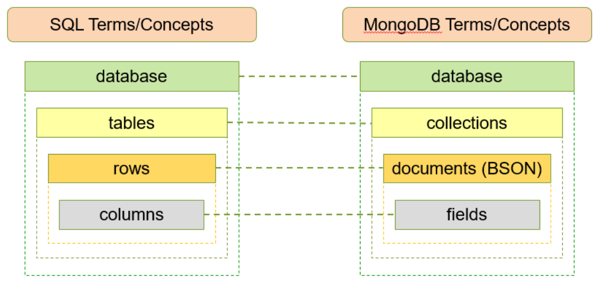

## Start
- From Command Prompt
```bash
mongo
```

## Terminologies


## Some ideas
- Sacrifice redundancy to improve scalability
- A MongoDB server can store multiple DBs, each DB has its own group of files

## Syntactic rules
- Commands are space independent
- Field: a key-value pair in a document is denoted as a field
    - Field names may optionally have quotes, while text data entered as string MUST have quotes
    - Field names cannot start with the $ character
    - Field names cannot contain the . character

## Database
- Show
```bash
show dbs
```
- Display the name of the current DB
```bash
db.getName()
```
- Create: Create a new one if DB's name doesn't exist. Once created, switch to the created DB
```bash
use DatabaseNameDB
```
- Switch to a DB
```bash
use DatabaseName
```

## Collection
- Show
```bash
show collections
```
- Create
```bash
db.createCollection("collectionName")
```

- Drop (also delete all documents in it)
```bash
db.<database name>.drop()
```

- Delete all documents in a collection
```bash
db.<database name>.remove({})
```

- Rename
```bash
db.<database name>.renameCollection("new name")
```

## Document
> `_id` 
> - Is a mandatory field for every document. Serves as the **primary key** of the document
> - Its value must be unique in the collection
> - If we don't pass a value in, MongoDB will automatically assign a value

- Insert
```bash
db.<collection name>.insert( <document> ) 
db.<collection name>.insertOne(<document> )
db.<collection name>.insertMany([{d1}, {d2}.., {d3}] )

# Example
db.user.insert({
    first: "John",
    last: "Doe",
    age: 39
})

# Example insertMany
db.user.insert([
    {
        first: "John",
        last: "Doe",
        age: 39
    },
    {
        first: "John",
        last: "Donne",
        age: 39
    }
])
```

- Find/Print all
```bash
db.<collection name>.find().pretty()
```

- Find with query
```bash
db.<collection name>.find(<query>, <projection>)

# - <query>, and <projection> are optional
# - <query> equiv to WHERE clause
# - <projection> equiv to SELECT clause
#       - The value with each key is either 0 or 1 (1 means the value pair should be included)

# Filter + Projection
SELECT name, cell
FROM friends
WHERE city = "Boston";

db.friends.find(
    {City: "Boston"},
    {name: 1, cell: 1, _id: 0}
)

# Boolean filtering
SELECT * FROM users WHERE a=1 OR b=2;
db.users.find({$or: [{a: 1}, {b: 2}]})

# Explicit logical `$and` is faster than implicit
db.patron.find({age:{$lt:21}, {"checkouts.pubyear": 2017}) # implicit
db.patron.find({$and: [{age:{$lt:21}}, {"checkouts.pubyear":2017}]) # explicit

# Sort
db.users.find({age: {$gt: 18, $lt: 40}}).sort({age: 1}) # ascending
db.users.find({age: {$gt: 18, $lt: 40}}).sort({age: -1}) # descending

# Limit
db.<collection name>.find().limit(100)

# Skip
db.<collection name>.find().limit(100).skip(5)
```

- Comparison operators
    - `$eq`, `$ne`, `$gt`, `$gte`, `$lt`, `$lte`
    - `$in`, `$nin`
    - `$or`, `$and`, `$not`, `$nor`

- Count
```bash
SELECT COUNT(*) FROM users;
db.users.count()
db.users.find().count()

SELECT COUNT(user_id) FROM users;
db.users.count({user_id: {$exists: true}})
db.users.find({user_id: {$exists: true}}).count()

SELECT COUNT(*) FROM users WHERE age > 30;
db.users.count({age: {$gt: 30}})
db.users.find({age: {$gt: 30}}).count()
```

- Distinct
```bash
SELECT DISTINCT(status) FROM users;
db.users.distinct("status")
```

- Update
```bash
# Update some fields
# upsert
#    - true: If criteria is not met, a new doc is inserted into the collection
#    - false (default): if no documents match the criteria, no changes will be made
# multi
#   - true: All documents that match are updated
#   - false (default): Only the first document which matches is updated
db.collection.update( <query>, <update>, <upsert>, <multi> ) 
db.collection.updateOne( <query>, <update>, <upsert>, <multi> ) 
db.collection.updateMany( <query>, <update>, <upsert>, <multi> ) 

# Replace the entire doc (still keeps the old _id)
db.collection.replaceOne( <query>, <replacement>, 
<options> )

# Example updateMany with multiple fields
db.users.updateMany({age: {$lt: 18}}, {$set: {status: "promoted", bonus: 1000}})
```

- Remove a field from a doc/docs
```bash
db.<collection name>.update({<filter>}, {$unset: {keyToRemove: 1}})
```

- `$inc` to increment/drecement a numeric val
```bash
# Increase the price of all chairs by $50
db.products.update({type: "char"}, {$inc: {price: 50}}, false, true)
```

- Rename keys
```bash
db.<collection name>.update({}, {$rename: {oldName: "newName"}}, {multi: true})
```

- Delete
```bash
db.collection.deleteOne( <query>, <options> ) 
db.collection.deleteMany( <query>, <options> ) 
db.collection.deleteMany({}) # delete all documents
db.collection.findOneAndDelete(<filter>, <options>)
```

- Pattern matching with regex
```bash
SELECT * FROM posts WHERE tags LIKE "tut%"
db.posts.find({tags: {$regex: "^tut"}})
```

## Aggregation Pipeline Framework
- A framework for data aggregation through a data processing pipelines
- Docs enter a multi-stage pipeline that transforms the docs into aggregated results
- input &rightarrow; $match &rightarrow; $group &rightarrow; $sort &rightarrow; output

```
db.collectionName.aggregate([
    {$match: {...}},
    {$group: {...}},
    {$sort: {...}},
    {$out: "newCollectionName"}
]).pretty()
```

- COUNT(*) query
```bash
SELECT COUNT(*) AS count FROM orders;
db.orders.aggregate([
    {
        $group: {
            _id: null,
            count: {$sum: 1}
        }
    }
])
```

- SUM() query
```bash
SELECT SUM(price) AS total FROM orders
db.orders.aggregate([
    {
        $group: {
            _id: null,
            total: {$sum: "$price"}
        }
    }
])
```

- GroupBy query
```bash
SELECT cust_id, ord_date, SUM(price) AS total
FROM orders
GROUP BY cust_id, ord_date

db.orders.aggregate([
    {
        $group: {
            _id: {
                cust_id: "$cust_id",
                ord_date: {$dateToString: {
                    format: "%Y-%m-%d",
                    date: "$ord_date"
                }}
            },
            total: {$sum: "$price"}
        }
    }
])
```

- WHERE + GROUP BY
```bash
SELECT cust_id, SUM(price) AS total
FROM orders
WHERE status = 'A'
GROUP BY cust_id
ORDER BY total;

db.orders.aggregate([
    {$match: {status: 'A'}},
    {
        $group: {
            _id: "$cust_id",
            total: {$sum: "$price"}
        }
    },
    {$sort: {total: 1}}
])
```

- WHERE - GROUP BY - HAVING query
```bash
SELECT cust_id, COUNT(*)
FROM orders
GROUP BY cust_id
HAVING COUNT(*) > 1;

db.orders.aggregate([
    {$match: {status: 'A'}},
    {
        $group: {
            _id: "$cust_id",
            count: {$sum: 1}
        }
    },
    {$match: {count: {$gt: 1}}}
])
```

**NOTE:** In the examples above, instead of `$sum`, can use `$min`, `$max`, `$avg`

- Add new fields to docs
```bash
# Example
db.scores.aggregate([
    {
        $addFields: {
            totalHomework: {$sum: "$homework"},
            totalQuiz: {$sum: "$quiz"}
        }
    }
])
```

- `$out` creates a new collection from aggregation
```bash
# Example
db.books.aggregate([
    {$group: {_id: "$author", books: {$push: "$title"}}},
    {$out: "authors"}
])
```

## Multimedia data
- MongoDB normally stores obj limited to 16 MB in size in BSON format
- Data such as images, audio, and video tend to be more than 16 MB in size
- MongoDB uses the GridFS spec to store data over 16 MB. It divides the files into at most 255KB blocks, for storage in a separate document.
- The metadata and blocks are stored in 2 formats: `fs.files` and `fs.chunks` &rightarrow; makes it easier to efficiently retrieve a specific range of the given file

## Indexing
- Default index is `_id` field
- A `B+` tree is created for each index
- By default, MongoDB automatically create an index only on the `_id` field of each collection to enforce the uniqueness
- Secondary index can also be created on any field or its subfield
- A collection can have up to 64 indexes
- A `compound index` 
    - Can have up to 32 fields
    - In SQL, this kind of index was called the composite index
    - The order of field is important
- An index entry has to be < 1024 bytes
- MongoDB uses `multikey indexes` to index the content stored in arrays
- Only one index can be used by the query optimizer when retrieving the data
- Each index requires at least `8kb` of data space
- When active, each index will consume some disk space and memory. This is significant when tracked in capacity planning
- For `a high read-to-write ratio collection` additional indexes improve perf and do not affect un-indexed read oprerations

- View all
```bash
SELECT * FROM USER_INDEXES WHERE table_name = "books";
db.books.getIndexes()
```

- Create
```bash
# Specify the fields and associated sort order
# 1 for ascending, -1 for descending
db.Employee.createIndex( { Name: 1 } )

# Compound Index
db.Employee.createIndex({Employeeid: 1, EmployeeName: 1})
```

- Drop
```bash
db.Employee.dropIndex({Name: 1})
db.Employee.dropIndexes() # drop all indexes except `_id` field
```

### Text Indexes
- Index on string value fields
- Use "text" that replaces the index sort order (1 or -1)
- A collection can have at most one text index
- A text index is time-consuming to build + could grow big
- A text index removes stop words and store only root words
```bash
# Example: create text index on description field
db.post.createIndex({decription: "text"})
```

### Hash Indexes
- A hash index contains hashed values of the indexed field
- A hash index is ideal for **equality matching** but not for range queries
- Hashed indexes are used internally by MongoDB for hash-based sharding
```bash
# Example: create a hashed index on title field
db.books.createIndex({title: "hashed"})
```

### TTL Indexes
- Time-To-Live indexes are used to automatically delete docs after an expiration time
- The field in TTL must be a date
- TTL index is a single field index and cannot be a compound index
```bash
# Example: delete the doc after one day
db.books.createIndex({creationDate: 1}, {expireAfterSeconds: 86400})
```

### Partial Indexes
- A partial index creates an index only to the docs that satisfies the `partialFilterExpression` query
```bash
# Create an index for the books whose price is > 30
db.books.createIndex(
    {price: 1, name: 1},
    {partialFilterExpression: {price: {$gt: 30}}})
```

### Unique Indexes
- Similar to RDBMS Unique index
- MongoDB automatically creates a unique index on `_id` field
- Enforce uniqueness of the value during insertion
- Unique indexes cannot be created if the collection already duplicate values of the indexed field
```bash
# Create a unique index on book's name
db.books.createIndex({"name": 1}, {unique: true})
```