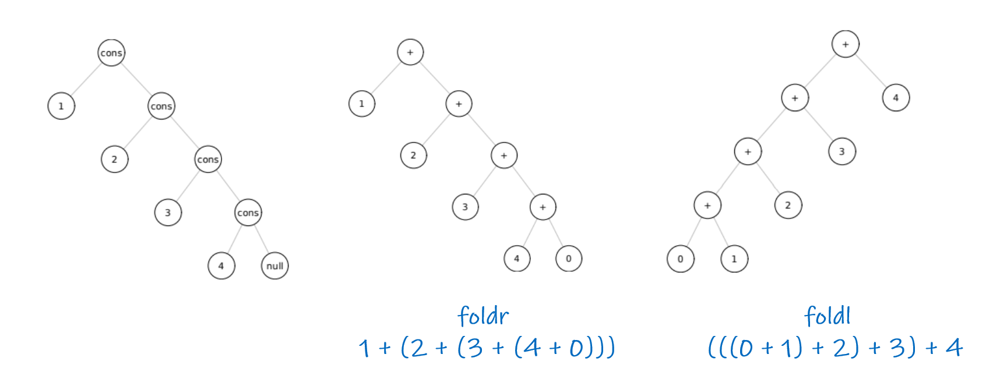

# To start interactive mode in Cmd
```
racket
```

# At the top of your Racket (.rkt) file
```scheme
#lang racket
```

# Comment
```scheme
; This is a comment. Multi-line comment doesn't exist
```

# Common Math functions
```scheme
(+ 1 1) ; 1 + 1
(- 5 1) ; 5 - 1
(* 4 2) ; 4 * 2
(/ 5 2) ; 5 / 2
(expt 2 3) ; Equivalent to 2**3
(modulo 4 2) ; Equivalent to 4 % 2
```

# Boolean Values
```scheme
(and true false) ; true and false
(and #t #f) ; can also be written in short notation
(or #t #t) ; or operator
```

# Variables
```scheme
; Assign
(define aVar 'aVal)

; Change the value of a var. Var must be defined first
; (set! <variable> <value>)
(set! aVar 'anotherVal)
```

# List Function
```scheme
'(1 2 3) ; This is a list. Notice that it is surrounded by parentheses BUT it has a ' in front of it. That stops the "function" from evaluating

'(peanut butter) ; Elements inside a list does not need the '
```
- `'(1 2 3)` is similar to `list(1 2 3) `
- `'` DOES NOT evaluate thing ---> `'(1 (+ 1 2) 3)` is different that `(list 1 (+ 1 2) 3)`
- `(first L)` takes a list `L` and returns the first S-expression. `first` is equivalent to `car`. **`fist` only works on non-empty list**
```scheme
(first '(1 2 3)) ; return 1
(first '(peanut butter)) ; return 'peanut
(first '((1 2) 3 4)) ; return '(1 2)
```
- `(second L)` like `first` but returns the second element
```scheme
(second '((1 2) 3 4)) ; return 3
```
- `(rest L)` takes a list `L` and returns a list of everything except the first element. **`rest` works only on non-empty list**
```scheme
(rest '(1 2 3)) ; return '(2 3)
```
- `cons` adds any S-expression to the front of a list &rightarrow; `cons` takes 2 args: any S-expressions + any list
```scheme
(cons 1 '()) ; append 1 to an empty list -> return '(1)
```
- `length` returns the length of a list
```scheme
(length '(1 2 3))	; return 3
```
- `append` concates 2 lists
```scheme
(append '(1) '(2 3))	; returns '(1 2 3)
```
- `remove-duplicates` takes a list `L` and remove all duplicates from it
```scheme
(remove-duplicates '(1 1 2 3)) ; return '(1 2 3)
```

- `member` takes an atom and a lst `L` and returns the tail of `L` starting from that atom if that atom is in `L`, else `#f`
```scheme
(member 1 '(1 2 3)) ; returns #t
(member 10 '(1 2 3)) ; returns #f
```

# Boolean Functions
- `=` only works with numbers
```scheme
(= 5 0) ; returns #f
```
- `equal?` is structural equality. It does not convert between integral and floating point representations &rightarrow; should use for all but numbers
```scheme
(equal? '(1 2) '(1 2)) ; returns #t
```
- `eq?` is pointer comparison. It returns `
#t` if its arg refer to the same obj in memory
- `list?` returns `#t` if the provided argument is a list
```scheme
(list? '(1 2 3)) ; returns #t
(list? 1) ; returns #f
```
- `null?` takes a list `L` and returns `#t` if the argument is an empty list
```scheme
(null? '()) ; returns #t
(null? '(1 2 3)) ; returns #f
```
- `boolean?` returns `t` if the argument is a boolean
```scheme
(boolean? (and #t #f)) ; returns #t
(boolean? '(1 2)) ; returns #f
```
- `number?` returns `#t` if the argument is a number
```scheme
(number? 2)	; returns #t
```

# Conditionals
- Syntax is `(if (condition) (if-true) (if-false))`
```scheme
(if (= 1 1) (+ 1 1) (+ 1 1)) ; Since 1 is equals to 1, this evaluates to (+ 1 1) which is 2

; can be rewritten in nicer format with indentations
(if (= 1 1)
    (+ 1 1)
    (+ 1 1)
)
```
- Use `cond` for `if-else if-else` statements
```scheme
(cond
  [(list? x) (display "List type")]
  [(symbol? x) (display "Symbol type")]
  [(equal? x 1) (diplay "x = 1")]
  [else (display "idk")]
)
```

# Functions
- In Racket, anything surrounded by parentheses `()` is a "function". Function call looks like `(functionName arg1 arg2 ... argn)`
- syntax for declaring a function is `(define (functionName arg1 arg2 ... argn) (functionBody))`
```scheme
(define (factorial n)
  (if (= n 0)
      1
      (* n (factorial (- n 1)))
  )
)

; Call the function
(factorial 5) 
```

# Unit Test
```scheme
(require rackunit)
(require rackunit/text-ui)
(define-test-suite nameOfTheTestSuite
	(check-equal? (functionName arg) expectedOutput)
	(check-equal? (functionName arg1) expectedOutput)
	(check-equal? (functionName argN) expectedOutput)
)

(run-tests nameOfTheTestSuite 'verbose)
```

# High-order functions
- `(map f L)` apply function `f` to each elem in list `L`
```scheme
(map (lambda (x) (* x 2)) L)
```
- Reduce right with `foldr` and reduce left with `foldl`
> The idea behind fold: replace `cons` with a function of our choice, and replace `null` with a value of our choice
> - `foldr` is called a right-fold cuz it treats function `f` as a right-associative op. Any recursive function on a list can be expressed as a right fold.


```scheme
(foldr + 0 '(1 2 3 4))	; Equivalent to (+ 1 (+ 2 (+ 3 (+ 4 0))))
(foldl + 0 '(1 2 3 4))	; Equivalent to (+ 4 (+ 3 (+ 2 (+ 1 0))))
```


