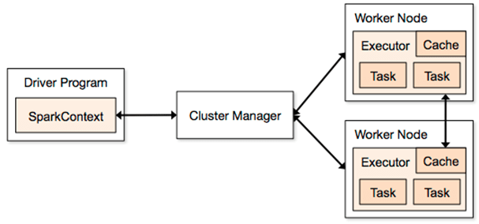

# Intro
> Spark is a fast, **in-memory data processing engine** -> allows data workers to efficiently execute streaming, ML or SQL workloads that require fast iterative access to datasets 
- Speed: fast since it runs computations in memory
- Advanced DAG execution that supports acyclic data flow
- Enables operations in Hadoop to run faster than MapReduce even when running on disk

# Installation 
https://docs.microsoft.com/en-us/dotnet/spark/tutorials/get-started?tabs=windows (Skip all parts related to .NET)

If on Windows, download `winutils.exe` from https://github.com/cdarlint/winutils

# Spark's components
- Spark Core: Is the foundation engine
- Spark SQL: A package built on top of Spark Core designed for working with structured data. Provides an SQL-like interface 
- Spark Streaming: An extension running on top of Spark. Provide API for manipulating data streams
- Spark MLlib: A library built on top of Spark for scalable machine learning
- GraphX: Graph computation engine built on top of Spark for creating and transforming graph

# Architecture: Master and Slave

- One master, Multiple slaves
- The driver and each of the worker run in their own Java processes
- Driver's program execution is called a **job**. Driver convert Spark's jobs into tasks
- Once workers finish their tasks, the result is sent back to the Driver
- Driver program communicates with Spark through `SparkContext` i.e. the connection to the Spark's cluster

# Creating a Spark app
- Spark's config
```scala
/* Creating Spark app's config
 * `setMaster` requires a master URL for a distributed cluster or `local` to run locally
 * local[n] will run locally with n threads
 * local[*] will run with with as many threads as logical cores 
 */ 
val conf = new SparkConf().setAppName("my app").setMaster("local[*]")
```

- Spark's context: main entrance -> represents a connection to a Spark's cluster
```scala
val sc = new SparkContext(conf)
```

# Running Spark app on a cluster
- User submits an app using `spark-submit`
- `spark-submit` launches the driver program and invokes the `main` method specified by the user
- The driver program contacts the cluster manager (eg: `Hadoop Yarn`) to ask for resources to start executors
- Cluster manager launches executors on behalf of the driver program
- The driver process runs through the user application. Based on the RDD or dataset operations in the program, the driver sends work to executors in the form of tasks

# RDD (Resilient Distributed Datasets)
> A capsulation around a very large dataset
- In Spark, all work is expressed as creating new RDDs, transforming existing RDDs, or calling operations on RDDs to compute a result -> Spark automatically distribute the data contianed in RDDs across cluster and parallelize operations performed on the RDD
- RDD is **distributed** i.e. each RDD is broken into many pieces called *partitions* and are divided across the clusters
- RDD is **immutale** i.e. can NOT be changed after they're created (to avoid problems related to updates from multiple threads)
- RDD is **resilient** i.e. deterministic function of their input -> RDD's parts can be recreated at anytime -> In case any node in the cluster goes down, Spark can recover those parts and pickup where it left off
### What to do with RDD
- **Transformation**: apply some functions to the data in RDD to create a new RDD
```scala
val lines = sc.textFile("fileName.txt")
val linewWithFriday = lines.filter(line => line.contains("Friday"))
```
- **Action**: Compute a result based on an RDD
```scala
val lines = sc.textFile("fileName.txt")
val firstElement = lines.first()
```
- Spark workflow: Generate inital RDDs from external data -> Apply transformations -> Launch actions

### Create a RDD
- Load RDDs from external storage with `SparkContext textFile()`
```scala
val sc = new SparkContext(conf)
val lines = sc.textFile("fileName.txt")
```
- Use `SparkContext parallelize()` on existing collection => NOT very practical way if the size of datasets are usually larger than the size of the memory of a single machine
```scala
val inputIntegers = List(1, 2, 3, 4)

// Elems in the collection will be copied to form a distributed dataset that can be operated on in parallel
val integerRdd = sc.parallelize(inputIntegers)
```

### Transformation
> **Always** return RDDs
- `filter()`
```scala
val cleanedLines = lines.filter(line => !line.isEmpty)
```
- `map()` returns a new RDD by applying a function to all elements of this RDD. The return type of `map()` IS NOT necessary the same as its input type
```scala
val urls = sc.textFile("urls.txt")
urls.map(url => makeHttpRequest(url))
```
- `flatmap()` returns a new RDD by first applying a function to all elems of this RDD, and then flatten the results
```scala
val lines: RDD[String] = sc.textFile("fileName.txt")
val words: RDD[String] = lines.flatMap(line => line.split(" ")) 
// If we use `map` we would get an RDD of array where each array contains words from a line
```
- `sample()` returns a sampled subset of an RDD. 

`sample(withReplacement: Boolean, fraction: Double, seed: Long)`
```scala
// Sample 10% of the data
val sampledData = data.sample(withReplacement = true, fraction = 0.1)
```

- `distinct()` returns a **new** RDD containing the distinct elems in the RDD (Note: A very expensive operation)
- Some useful set operations: `union()`, `intersection()`, `subtract()`, and `cartesian()` to calculate cartesian product
### Actions
> Operations that will compute a final value to the drier program or persist data to an extenral storage system -> **DOES NOT** return RDDs
- `collect()` retrieves the entire RDD and returns it to the driver program in the form of a regualr collection or value (eg: collect a String RDD -> receive a list of strings)
```scala
/* The entire dataset must fit in memory on a single machine when `collect` is called
 * ---> `collect` should NOT be used on large datasets
 */
val inputWords = List("spark", "hadoop", "spark", "hive")
val wordRdd = sc.parallelize(inputWords)
val words = wordRdd.collect() // words is a list of string
```
- `count()` returns the number of rows in an RDD
- `countByValue()` looks at unique values in each row of the RDD and return a frequency map of those values
- `take(n)`  takes n elems from an RDD -> useful for peeking at the RDD
- `saveAsTextFile()` writes data out to a distributed storage system (HDFS, Amazon S3) or local file system
- `reduce()` takes a function that operates on **2** elems of the type in the input RDD and return **a** new elem of the same type -> reduces the elements in the RDD using the specified binary function -> Useful for aggregations
```scala
val inputInts = List(1, 2, 3, 4)
val intRdd = sc.parallelize(inputInts)
val product = intRdd.reduce((x, y) => x*y)
```
### Persistence
- Sometimes, we want to call multiple actions on the same RDD -> call `persist()` on the RDD so that the RDD and its dependencies are not recomputed every time
- When an RDD is persisted, the first time it's computed in an action, it'll be kept in memory across the nodes
- There're multiple storage level
    - `MEMORY_ONLY` (default option + equiv to `RDD.cache()`) Store as Java objs in the JVM. If too big, won't cached
    - `MEMORY_AND_DISK`: Similar to `MEMORY_ONLY` but if too big, store in disk too
    - `MEMORY_ONLY_SER`: Store as serialized Java objs (more space efficient but more CPU-intensive to read) If too big, won't cached
    - `MEMORY_AND_DISK_SER`: Similar to `MEMORY_ONLY_SER` but if too big, store in disk too
    - `DISK_ONLY`: Store only on disk

Option `MEMORY_ONLY_SER` and `MEMORY_AND_DISK_SER` are only available to Java and Scala
```scala
val inputInts = List(1, 2, 3, 4)
val intRdd = sc.parallelize(inputInts)
intRdd.persist(StorageLevel.MEMORY_ONLY)
val product = intRdd.reduce((x, y) => x*y) // 1st action
val cnt = intRdd.count() // 2nd action
```
- Choosing storage level
    - If the RDD can fit with the default storage level, pick `MEMORY_ONLY` -> most CPU-efficient + allow fast operations on the RDDs
    - If not, pick `MEMORY_ONLY_SER` -> more space-efficient + operations reasonably fast
    - Don't save to disk unless the operations on the datasets are expensive or they filter a significant amount of the data

# Pair RDD
> A type of RDD that can store key-value pairs

### Create Pair RDD
- From a list of tuples using `SparkContext parallelize()`
```scala
val tuples = List(("a", 1), ("b", 2), ("c", 3))
val pairRDD = sc.parallelize(tuples)

pairRdd.coalesce(1).saveAsTextFile("out.txt") // pretty print to file
```

- From a regular RDD using `map()`
```scala
val strs = List("Lily 23", "Jack 29", "Mary 20")
val regRDDs = sc.parallelize(strs)
val pairRDD = regRDDs.map(s => (s.split(" ")(0), s.split(" ")(1)))
```

### Transformation
> All transformation available to regular RDDs are available to pair RDDs
- `filter()`
```scala
val strs = List("Lily 23", "Jack 29", "Mary 20")
val regRDDs = sc.parallelize(strs)
val pairRDD = regRDDs.map(s => (s.split(" ")(0), s.split(" ")(1)))
val cleaned = pairRDD.filter(pair => pair._2 > 23)
```
- `mapValues()` is similar to `map()` but only apply the specified function on the values
- `reduceByKey()` runs several parallels `reduce()` operations, one for each key where each operation combines values that have the same key
```scala
// Calculate word frequency where wordRddd is a RDD[String] of words
val wordPairRdd = wordRdd.map(word => (word, 1))
val wordCounts = wordPairRdd.reduceByKey((x, y) => x + y)
for ((word, count) <- wordCounts.collect()) println(word + " : " + count)
```
- `groupByKey()`

# Spark Session
> Provides a single point of entry to interact with underlying Spark functionality and allows programming Spark with DataFrame and DataSet APIs
- All functionalities available through `SparkContext`, `SQLContext` and `HiveContext` are available through `SparkSession`

- Create 
```scala
import org.apache.spark.sql.SparkSession
val spark = SparkSession
    .builder()
    .appName("My app")
    .config("spark.some.config.option", "some value")
    .getOrCreate()
```

# Schema conversion magic
> i.e. in order to use method like `toDS()` and `toDF()`
- Import
```scala
import session.implicits._
```

# DataFrame
> Immutable distributed collection of data 
- Is lazily evaluates like RDD transformations
- Unlike RDD, data is organized into named columns like a tale in a relational DB (but with richer optimization)
- Allow higher-level abstraction on collection of data
- Can be built from different data sources such as structured data file, HIVE tables, external DB or existing RDDs

Example creating a dummy DataFrame
```scala
import session.implicits._

val payment = sc.parallelize(Seq((1, 101, 2500), (2, 102, 1110))).toDF("paymentId", "customerId", "amount")
payment.show()
```

Example creating from a JSON file
```scala
val df = spark.read.json("example.json")
df.show()
```

#### Useful APIs
import session.implicits._

```scala
// Show
df.show()

// Select columns
df.select($"columnName")
df.select($"col1", $"col2")
df.select($"col1" as "COL 1", $"col2")

// Filter
df.filter($"columnName" > 200)

// GroupBy
df.groupBy($"columnName").mean()
```

# Dataset
> A **strongly typed** collection of domain-specific objs that can be transformed in parallel using functional or relational operations
- DataSet is an extension of a DataFrame. 
- DataSet represents data in the form of JVM objs of row or a collection of row oject
- Why Dataset?
    - Rich semantics, high-level abstractions and domain specific APIs are needed
    - Processing requires aggregation, averages, sum, SQL queries, and columnar access on semi-structured data
    - Unification and simplification of APIs across Spark Libraries

===> Prefer Dataset over RDD    

### Row Object
- Row obj represent records inside dataset and are simple **fixed-length arrays of fields**
- Have getters to get value of each field given its index
```scala
val field7 = row.get(7) // type Any
val field1 = row.getLong(1) // type Long
val field2 = row.getBoolean(2) // type Boolean
```

### Encoders
> Translate between JVM's Java objs and Spark's internal binary formal
- Is primary concept in serialization and deserialization framework in Spark SQL
- Provides on-demand access to individual attributes without having to de-serialize an entire obj
- Spark has built-in encoders such as integer encoder or long encoder 

### DataFrame to DataSet
```scala
// Create a dataset of type "UserDefinedType"
val dataset = aDataFrame.as[UserDefinedType]
```

### RDD to DataSet
```scala
import session.implicits._
val dataSet = rdd.toDS()

// DataSet to RDD
dataSet.rdd
```

#### Useful APIs
```scala
// Print out schema
dataset.printSchema

// Print the count
dataset.count

// Print the first n rows
dataset.show(n)

// Filter
dataset.filter(row => row.fieldName == ...).show()

// Groupby
dataset.groupBy($"columnName").show()

// Order by 
dataset.orderBy(dataset.col("columnName").desc).show()
dataset.orderBy(desc($"columnName")).show()


// Map
dataset.map(row => row.fieldname ... )
```

# Join
```scala
import session.implicits._

val payment = sc.parallelize(Seq((1, 101, 2500), (2, 102, 1110))).toDF("paymentId", "customerId", "amount")
payment.show()

val customer = sc.parallelize(Seq((101, "Jon"), (102, "Aron"), (103, "Sam"))).toDF("customerId", "name")
customer.show()

// Inner join
val innerJoinDf = customer.join(payment, "customerId")
val innerJoinDf1 = customer.join(payment,  Seq("customerId"), "inner")

// Left join
val leftJoinDf = customer.join(payment,  Seq("customerId"), "left")

// Right join
val rightJoinDf = customer.join(payment,  Seq("customerId"), "right")
```

# User-defined functions (UDFs)
- After you define UDFs and register them, you can use them in DataFram/Dataset APIs
```scala
import org.apache.spark.sql.functions.{udf}

// Define
val squared = (s: Long) => {
    s * s
}

/* Register with udf 
 * The first param in `[]` is the return type of the function
 * Subsequent params in `[]` are the params' types of the function
 */
val square = udf[Long, Long](squared)

// Call
payment.select(square($"amount") as "squaredAmount").show()
```

# .CSV files
```scala
// Read
sparkSession.read
    .format("csv")
    .option("header", "true")
    .option("delimiter", ",")
    .load("fileName.csv")

// Write
myDataset.write
    .format("csv")
    .option("delimiter", ",")
    .mode(SaveMode.Overwrite)
    .save("output.csv")    
```
# Parquet files
> Default data source in Spark
```scala
// Read
var file = "abc.snappy.parquet"
val df = sparkSession.read
    .format("parquet")
    .load(file)

// Write
df.write.format("parquet")    
    .mode("overwrite")
    .option("compression", "snappy")
    .save("path/to/destination")
```
