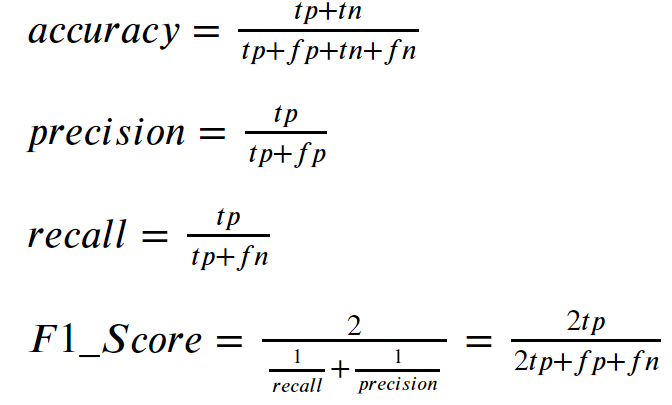

# Install
```python
pip install -U sckikit-learn
```

# Rescale
- Scale with `MinMaxScaler`

`MinMaxScaler` takes each feature and scales it to the range 0 - 1. It replaces the min value with *0*, the max with *1* and the other vlaues somewhere in between based on a linear mapping.
```python
from sklearn.preprocessing import MinMaxScaler
scaler = MinMaxScaler()
scaled = scaler.fit_transform(df)
```

- Scale with `StandardScaler`

`StandardScaler` forces each feature to have a 0 mean and a variance of 1 &rightarrow; commonly used starting point for normalization
```python
from sklearn.preprocessing import StandardScaler
scaler = StandardScaler()
scaled = scaler.fit_transform(df)
```

- Scale with `Normalizer`

`Normalizer` ensures the sume of the values for each sample equals to 1
```python
from sklearn.preprocessing import Normalizer
```

- Scale with `Binarizer`

`Binarizer` turn numerical features into binary features, where any value above a threshold is 1 and any below is 0
```python
from sklearn.preprocessing import Binarizer
```

# Encode categorical features
- Encode one categorical string columns
```python
from sklearn.preprocessing import OneHotEncoder
onehot = OneHotEncoder()
encodedCol = onehot.fit_transform(dataset[["CatCol"]]).todense()
```

- Encode multiple categorical columns with the same encoder
```python
# Encode categorical data into integer values
from sklearn.preprocessing import LabelEncoder
encoding = LabelEncoder()
encoding.fit(dataset["CategoricalColumnName"].values)
encodedCol1 = encoding.transform(dataset["CatCol1"].values)
encodedCol2 = encoding.transform(dataset["CatCol2"].values)
newColumns = np.vstack([encodedCol1, encodedCol2]).T

from sklearn.preprocessing import OneHotEncoder
onehot = OneHotEncoder()
newColumns = onehot.fit_transform(newColumns).todense()

# oldColumns = dataset["col1", "col2"].values
newDataset = np.hstack([oldColumns, newColumns])
```

# Split 
> Split dataset into train set and test set
```python
from sklearn.model_selection import train_test_split

'''
@test_size: proportion of the test split (default is 0.25)
@random_state: controls the shuffling applied to the data before the split -> Setting the random state will give the same split every time the same value is entered. It will look random, but the algo used is deterministic and the output will be consistent. To get truly random results that change every time you run, set random_state to None
'''
X_train, X_test, y_train, y_test = train_test_split(X, y, test_size = 0.2, random_state = 0)
```

# Evaluate
- Confusion Matrix
    - True positive (tp): “This is iris-setosa, we predicted as iris-setosa”
    - False positive (fp) (Type 1 Error): “this is not iris-setosa, we predicted as iris-setosa”
    - False negative (fn) (Type 2 Error): “this is iris-setosa, we predicted as not iris-setosa”
    - True negative (tn): “this is not iris-setosa, we predicted as not iris-setosa”

|      |positive | negative |
|------|------|------|
|positive|tp |fp|
|negative|fn | tn|



```python
from sklearn.metrics import confusion_matrix
from sklearn.metrics import classification_report

# Summary of the predictions made by the classifier
print(classification_report(y_test, y_pred))
print(confusion_matrix(y_test, y_pred))

# Accuracy score
from sklearn.metrics import accuracy_score
print(f'Accuracy is: {accuracy_score(y_pred,y_test)}')
```

# Logistic Regression
- Useful to run early in the workflow
- Measures the relationship between the **categorical** dependent variable (feature) on 1 or more independent variables (features) by estimating probabilities using a logistic function which is the cumulative logistic distribution
```python
from sklearn.linear_model import LogisticRegression

logreg = LogisticRegression()
logreg.fit(X_train, Y_train)
Y_pred = logreg.predict(X_test)

# Calculate feature's correlation to the dependent variable
# coeff_df is the `df` WITHOUT the dependent variable
coeff_df.columns = ['Feature']
coeff_df['Correlation'] = pd.Series(logreg.coef_[0])
coeff_df.sort_values(by='Correlation', ascending=False)
```

# Support Vector Machines
- A supervised learning model used for classification and regression analysis
- Is a non-probabilistic binary linear classifier
```python
from sklearn.svm import SVC

svc.fit(X_train, Y_train)
Y_pred = svc.predict(X_test)
```
```python
from sklearn.svm import LinearSVC

linear_svc = LinearSVC()
linear_svc.fit(X_train, Y_train)
Y_pred = linear_svc.predict(X_test)
acc_linear_svc = round(linear_svc.score(X_train, Y_train) * 100, 2)
```

# k-Nearest Neighbors (k-NN)
- A non-parametric method for classification and regression
- A sample is classified by a majority vote of its k nearest neighbors
```python
from sklearn.neighbors import KNeighborsClassifier

knn = KNeighborsClassifier(n_neighbors = 3)
knn.fit(X_train, Y_train)
Y_pred = knn.predict(X_test)
```

# Naive Bayes
- A family of simple probabilistic classifiers based on applying Bayes' theorem with strong independence assumptions between the features
```python
from sklearn.naive_bayes import GaussianNB
from sklearn.naive_bayes import BernoulliNB # BernoulliNB is designed for binary features

nb = GaussianNB()
nb.fit(X_train, Y_train)
Y_pred = nb.predict(X_test)

# To extract what the most important features to the model are
# Get only the Naive Bayes step from the pipeline
nb = model.named_steps['naive-bayes']

# Each unique word is a feature. 
# The probabilities for each word are stored as log probabilites as log(P(A|f)) where f is a given feature
# The reason these are stored as log probabilities is because the actual values are ver low 
# -> Log stop underflow errors where small probabilities are just rounded to zeros
# Ofc, since the probabilities are multiplied together (check Naive Bayes theorem), a single value of 0 will
# result in the whole answer always being 0
feature_probabilities = nb.feature_log_prob_

# Get the top features' indices
top_features = np.argsort(-nb.feature_log_prob_[1])[:50]
```

# Perceptron
- Algorithm for supervised learning of binary classifiers (function that decide whether an input belongs to some specific class or not)
```python
from sklearn.linear_model import Perceptron

perceptron = Perceptron()
perceptron.fit(X_train, Y_train)
Y_pred = perceptron.predict(X_test)
```

# Stochastic Gradient Descent
```python
from sklearn.linear_model import SGDClassifier

sgd = SGDClassifier()
sgd.fit(X_train, Y_train)
Y_pred = sgd.predict(X_test)
```

# Decision Tree
- Uses a decision tree as a predictive model which maps features (tree branches) to conclusions about the target value (tree leaves)
- Tree models where the target var can take a finite set of vales = classification trees
- Tree models where the target var can take continuous values = regression trees
```python
from sklearn.tree import DecisionTreeClassifier

decision_tree = DecisionTreeClassifier(random_state=100)
decision_tree.fit(X_train, Y_train)
Y_pred = decision_tree.predict(X_test)
```

# Random Forest aka Random Decision Forests
- An ensemble learning method for classification, regression, etc
- Operate by constructing a multitude of decision trees (eg: `n_estimators = 100`) at training times and output the class that is the mode of the class (classification) or mean prediction (regression) of the individual trees 
- Parameters
    - **n_estimators**: how many decision trees should be built. Higher value will take longer to run but will result in a higher accuracy. Default value = 100
    - **oob_score**: if true, the method is tested using samples that aren't in the random subsamples chosen for training the decision trees
    - **n_jobs**: specifies the # of cores to use when training the decision trees in parallel. Use *-1* for use all cores
    - **min_samples_split**: specifies how many samples are needed in order to create a new node in the Decision Tree &rightarrow; whether a decision node will be created
    - **min_samples_leaf**: specifies how many samples must be resulting from a node for it to stay &rightarrow; whether a decision node will be kept
    - **criterion**: decide which rule and value to use to split a node into subnodes. Value: "gini", "entropy"

```python
from sklearn.ensemble import RandomForestClassifier

random_forest = RandomForestClassifier(n_estimators=100)
random_forest.fit(X_train, Y_train)
Y_pred = random_forest.predict(X_test)
random_forest.score(X_train, Y_train)
```

# Cross-fold validation
```python
from sklearn.model_selection import cross_val_score
import numpy as np

# To use f1-score instead of accuracy, change 'accuracy' to 'f1'
scores = cross_val_score(model_or_pipeline, X, y, scoring = 'accuracy')
print("Accuracy: {0:.1f}%".format(np.mean(scores) * 100))
```

# Pipeline
- Pipelines store the steps in your data mining workflow. They can take your raw data in, perform all the necessary transformations, and then create a prediction.
```python
from sklearn.pipeline import Pipeline
import numpy as np

# Take a list of steps as input 
# All steps are Transformers while the last step needs to be an Estimator
# The input dataset is altered by each Transformer with the output of 1 step being the input of the next step
scaling_pipeline = Pipeline([('scale', MinMaxScaler()),
                             ('predict', KNeighborsClassifier())])

# pipelines has type `estimator` so we can use them in functions such as `cross_val_score`
scores = cross_val_score(scaling_pipeline, X, y, scoring='accuracy')       
print("Accuracy: {0:.1f}%".format(np.mean(scores) * 100))                    
```
- We can get a specific step out of a pipeline
```python
from sklearn.pipeline import Pipeline
from sklearn.feature_extraction import DictVectorizer

pipeline = Pipeline([('vectorizer', DictVectorizer()), ('naive-bayes', BernoulliNB()) ])

model = pipeline.fit(X, y)

# Get the Naive Bayes step
nb = model.named_steps['naive-bayes']

# Get the vectorizer step
dv = model.named_steps['vectorizer']
```
- Customed transformer

This is for when we want to use our customed transformer in a Pipeline
```python
from sklearn.base import TransformerMixin

class CustomedTransformer(TransformerMixin):
    def fit(self, X, y):
        return <something here> # can return self

    def transform(self, X):
        return <something here> 
```

# Testing multiple parameters' values to tune model's parameters
- Use `GridSearchCV`
```python
# This example is testing on Random Forests

from sklearn.model_selection import GridSearchCV

# List out all params you want to try + the value to try
parameter_space = {
    "max_features": [2, 10, 'auto'],
    "n_estimators": [100, 200],
    "criterion": ["gini", "entropy"],
    "min_samples_leaf": [2, 4, 6],
}
clf = RandomForestClassifier(random_state=14)
grid = GridSearchCV(clf, parameter_space)
grid.fit(X_all, y_true)
print("Accuracy: {0:.1f}%".format(grid.best_score_ * 100))

# To see what parameters used, we can print out the best model that was found in the grid search
print(grid.best_estimator_)
```